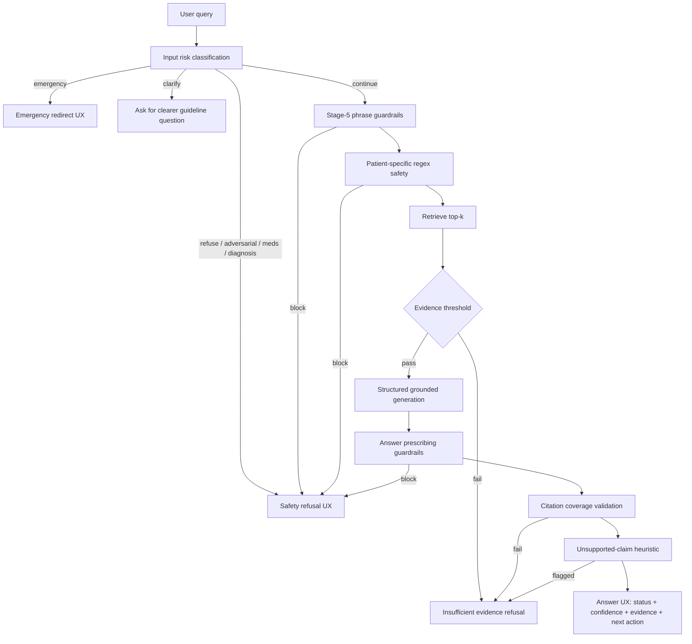

# Day 4 — Safety flowchart

## Guardrail zones

| Zone | Modules |
|---|---|
| Pre-generation | `risk_classification`, `guardrails.check_query`, `safety`, retrieval threshold |
| Post-generation | `guardrails.check_answer`, `validate_citations`, `claim_support` |
| UX | `serialize.grounded_result_to_response`, frontend Answer/Refusal cards |
